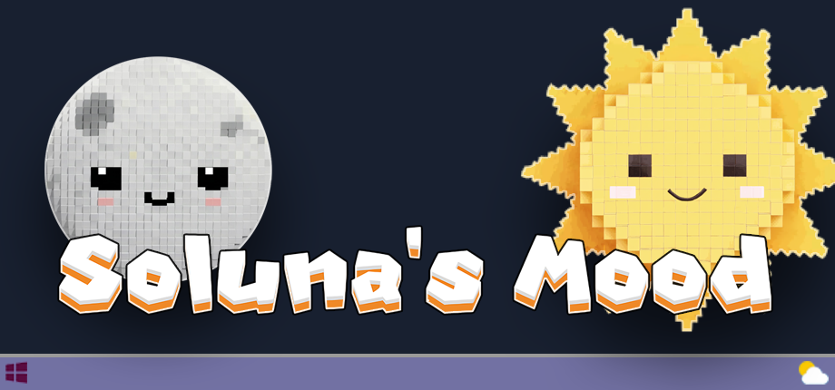
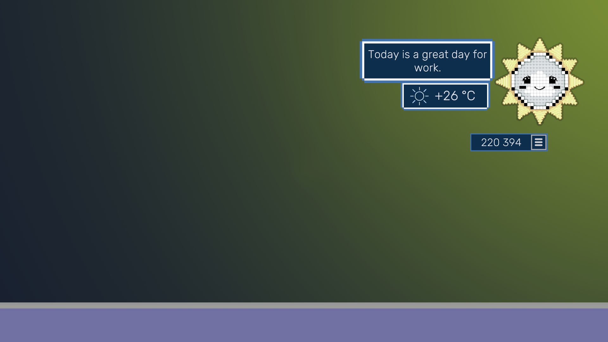
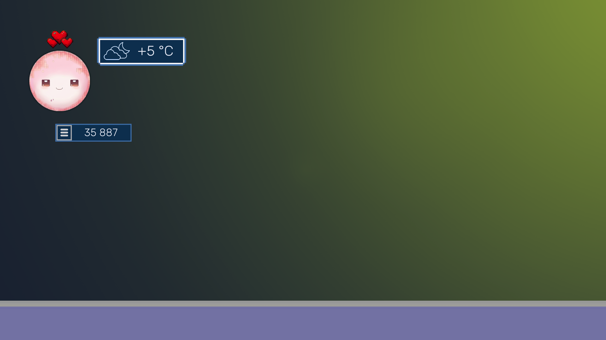
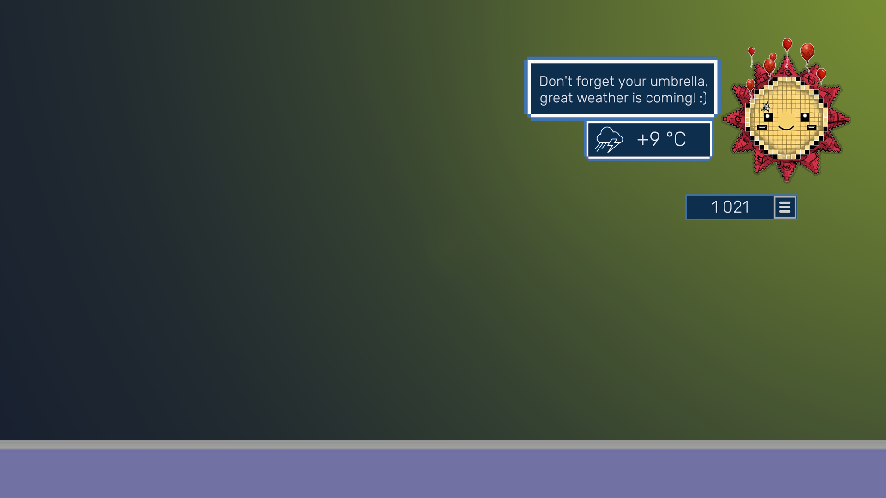
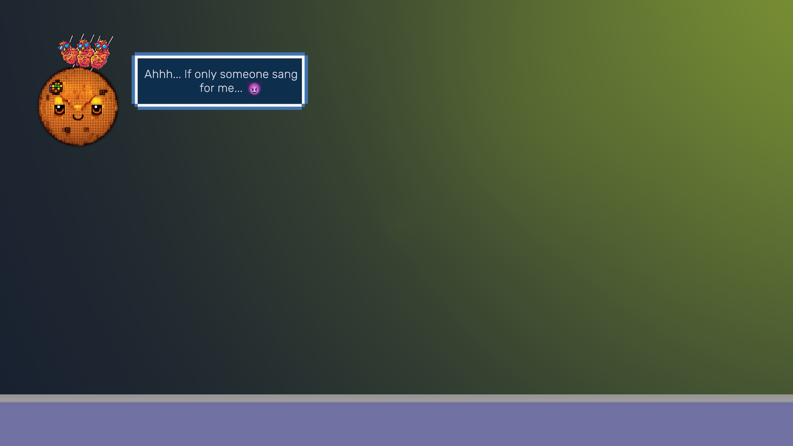
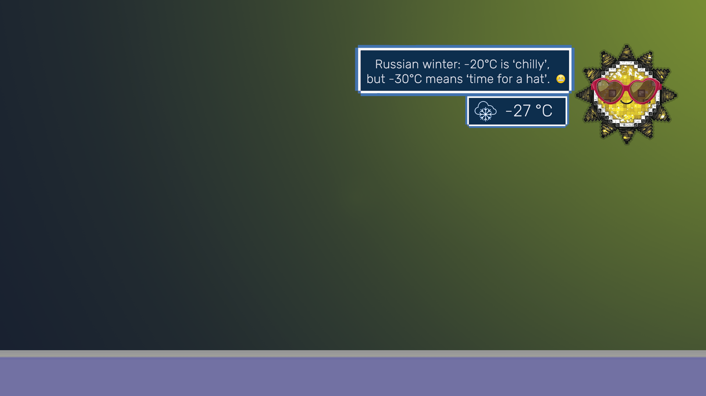
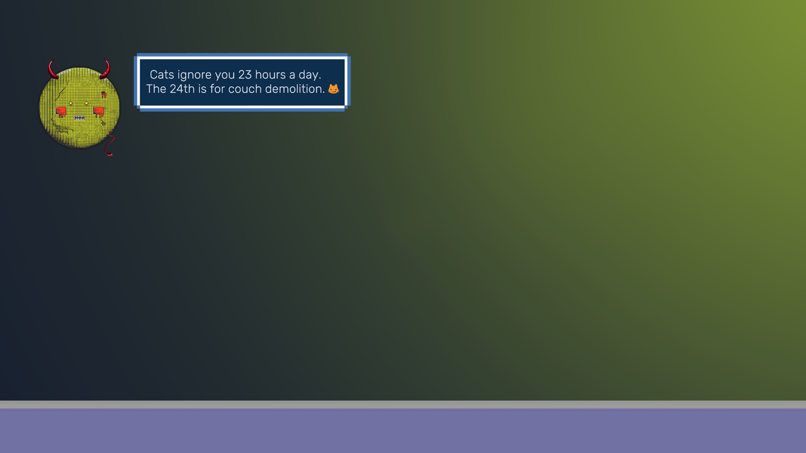

# Solanu's Mood 

   

## 🌞🌙A minimalist weather widget with personality!

A minimalist **desktop weather widget** that comes to life! Watch as **Sol** (the sun) and **Luna** (the moon) react to weather changes and time of day. Each has their own distinct personality—discover their quirks as you interact! Press keys and see how Sol or Luna respond. Earn points, collect hats, and help your celestial pals thrive!

## ✨ **Features:**

**Living Widget Characters**

-   **Sol** is lively and expressive (frowns in rain, cheers in sunshine)
-   **Luna** is a dreamy introvert (shows moon phases, yawns at dawn)
-   Reactions based on **real-time weather data**

**Collect & Customize**

-   Unlock **stylish accessories**: sunglasses, nightcaps, seasonal outfits
-   Change Sol & Luna’s appearance to match your mood

**Interactive Fun**

-   Earn points by clicking (_Bongo Cat-style mechanics!_)
-   Discover **hidden reactions** the more you interact

**Weather Forecast**

-   Stay updated on current conditions
-   Get **friendly advice** from Sol & Luna—they mean well!

## 🖥️ **Tech Specs:**

-   **Always-on-top mode**
-   **Low resource usage** (lightweight performance)
-   **Adjustable transparency**

🚀 Unlike static weather widgets, Sol & Luna are digital pets with real emotions!

## 💓 **Screenshots**

# ToDo

 - Mods support
 - More animations
 - Cursor following

# Contacts
     

E-mail: choco.16mail@mail.ru

# Bug-reports

If you find a bug or have any suggestions for improvement, please let us know: choco.16mail@mail.ru

# Updates

**v1.0.11 Small update**

ADDED:
-   Added flight behavior for the following items: Drone, Scroll Of Fire, Space Air Satellite, Moon Month, Air Green Dragon, Jellyfish Umbrella, Air Microphone, Air Moon Dragon, Balloon In The Clouds, Blue Ghost, Angel Wreath, Skeleton Fun, Weather Clouds, Flying Cat, UFO Cat, Transparent Ghost, Moon Book, Octopus Light Bulb.,
-   Added a rotation animation for the Ring Butterflies item.,

CHANGED:
-   Adjusted item prices in the shop.,
-   Balance: reduced the drop rate of Uncommon quality items.,
-   Added a setting to choose temperature display units (e.g., °C or °F).,
-   Characters now turn their eyes towards the source of dialogue when it appears.,

FIXED:
-   Fixed a bug where items could scale incorrectly (increasing or decreasing by 1.5x) when the window scale was set to a value other than 1.0.,
-   Fixed a bug where the point scoring sound effect could layer on top of itself and play for an abnormally long time.
- 
**v1.0.3 Small hot-fix**

 - Fixed a bug in the console after changing the game settings
 - Fixed the negative value of points after receiving an item
 - Fixed a bug due to which rewards were not given for switching to Discord or Community Group